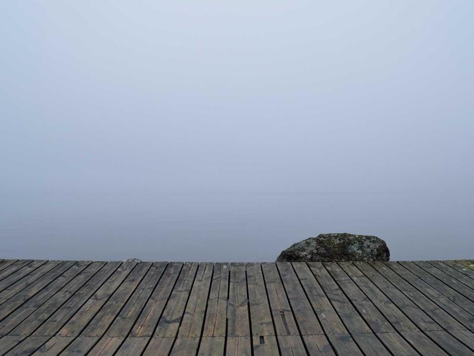

Workflow yang baik bisa meningkatkan produktivitas menulis secara signifikan. Berikut adalah workflow yang digunakan: mulai dari ide di Obsidian, draft, hingga publish di blog Hugo.

## Overview Workflow

```
Obsidian (Draft) → Git Push → Hugo Build → GitHub Pages (Live)
```

## Fase 1: Draft di Obsidian

Obsidian digunakan sebagai "second brain" — semua catatan, ide, dan draft artikel disimpan di sini. Format Markdown yang digunakan Obsidian 100% kompatibel dengan Hugo.

Struktur folder di Obsidian:

```
Vault/
├── Inbox/          # Catatan mentah, belum diproses
├── Notes/          # Catatan yang sudah diproses
│   ├── Linux/
│   ├── DevOps/
│   └── Coding/
└── Blog/           # Draft untuk blog
    ├── Published/  # Sudah dipublish
    └── Draft/      # Masih dalam proses
```

## Fase 2: Review dan Edit

Sebelum dipublish, artikel melewati proses review:

1. **Cek fakta** — pastikan semua perintah dan kode sudah ditest
2. **Struktur** — pastikan ada intro, body, dan kesimpulan
3. **Front matter** — tambahkan tags, kategoris, image, dan description
4. **Copy-edit** — perbaiki typo dan kalimat yang tidak jelas

## Fase 3: Publish

```bash
# Copy artikel ke folder Hugo
cp ~/Obsidian/Blog/Draft/artikel-baru.md ~/myblog/content/posts/

# Edit front matter draft: false
# Preview lokal
hugo server -D

# Commit dan push
git add .
git commit -m "Post: Judul Artikel Baru"
git push

# GitHub Actions otomatis deploy ke GitHub Pages
```

## Uji Coba Optimasi Gambar (Image Hooks)

Bagian ini ditujukan untuk memverifikasi fitur Lazy Loading dan Image Processing otomatis (WebP).

**1. Gambar Lokal (Leaf Bundle) - Otomatis WebP & Resize:**


**2. Gambar Eksternal (Remote) - Lazy Loading Only:**


